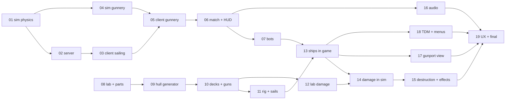

# Brickwake — build map

Label: wayfinder:map

## Destination

Brickwake built end to end: checkpoints C1–C9 and S1–S3 of `docs/game-design.md` pass
locally, and the game is ready for Joel to play a full round and judge it.

## Notes

- Spec: `docs/game-design.md` is the source of truth for every decision. Tickets point
  at its sections; they do not restate them. Joel's 2026-09-25 ruling (Decisions) sets
  the bar: premium in behaviour, effects and look; two gun decks; agents decide tuning
  and damage per hit; nothing waits on Joel.
- Execution is carried into this map: each ticket is a `task` (AFK) that builds its
  part and proves it. One opus worker at medium reasoning per ticket; the worker does
  the whole ticket itself and starts no subagents.
- How a ticket is worked:
  1. Read this map, your ticket, the spec sections it names, and the Answers of the
     tickets it is blocked by. Read `~/.agents/skills/coding-standards/SKILL.md`
     before touching `.ts`; Effect v4 source is at `~/.agents/repos/effect`.
  2. Build it. Keep feedback loops tight: run the tests you touched, not the world.
     Run `bun install` first if `node_modules` is missing (worktrees).
  3. Prove every "Done when" line with a command or a saved screenshot in `.shots/`,
     and look at the screenshots yourself against `reference/`.
  4. Set `Status: resolved`, append `## Answer` to the ticket: what was built, file
     entry points, measured numbers, facts later tickets need, known gaps (≤ 25 lines).
  5. Commit per `~/.agents/skills/commit/SKILL.md`.
- Two tracks run in parallel in git worktrees (gameplay 01–07, ship 08–12); the
  orchestrator merges and updates Decisions so far.

## Dependency graph

Gameplay track 01–07, ship track 08–12, merged 13–19.

## Decisions so far

- [Sim: ocean and ship physics](issues/01-sim-ocean-and-ship-physics.md) — force-based ship on `sampleOcean(sea,…)`; targets met (12 m/s beam reach, 12.3°/s turn, 8.3° heel); axes +x bow/+z starboard; fixed SIM_DT.
- [Ship lab and part library](issues/08-ship-lab-and-parts.md) — 51 LDraw-keyed chamfered shapes in `src/client/bricks/`, instanced per shape with swap-remove; 60 tris/brick means hulls must cull enclosed parts and covered studs.
- [Server: room, tick loop and protocol](issues/02-server-room-and-protocol.md) — `/ws` join→welcome(sea, wind, ships)→30 Hz snapshots with ticked events; scenario rooms for tests; NET_LATENCY_MS/NET_JITTER_MS; 181 B/ship.
- [Sim: gunnery and hits](issues/04-sim-gunnery.md) — `aimGun`/`broadsideRefusal` shared aim solve, drag 0.04/s, ~300 m max range, 1° cone spread (±18 m in range at 220 m — revisit in 19), fire/hit/splash events on the wire.
- [Client: sail a grey-box ship on the ocean](issues/03-client-sailing.md) — `src/client/game/`; render hooks + tick-queued event handlers; `window.brickwake` debug hook; 4.5 ms GPU at DPR-capped 1.5; MSAA half-float is half the GPU cost.

## Not yet specified

- Below-waterline holes and flooding driven by the removed-brick set: in scope only if
  14 shows it fits cheaply; otherwise it moves to Out of scope.
- Final tuning numbers (wind, damage, reload, bot accuracy) are settled by play in 19.

## Out of scope

- Hosting, playing with friends online, more ship classes, cannon or ammo types,
  islands and the fortress (spec: Later).
- Client-side prediction, unless 03 or 19 shows helm lag.
